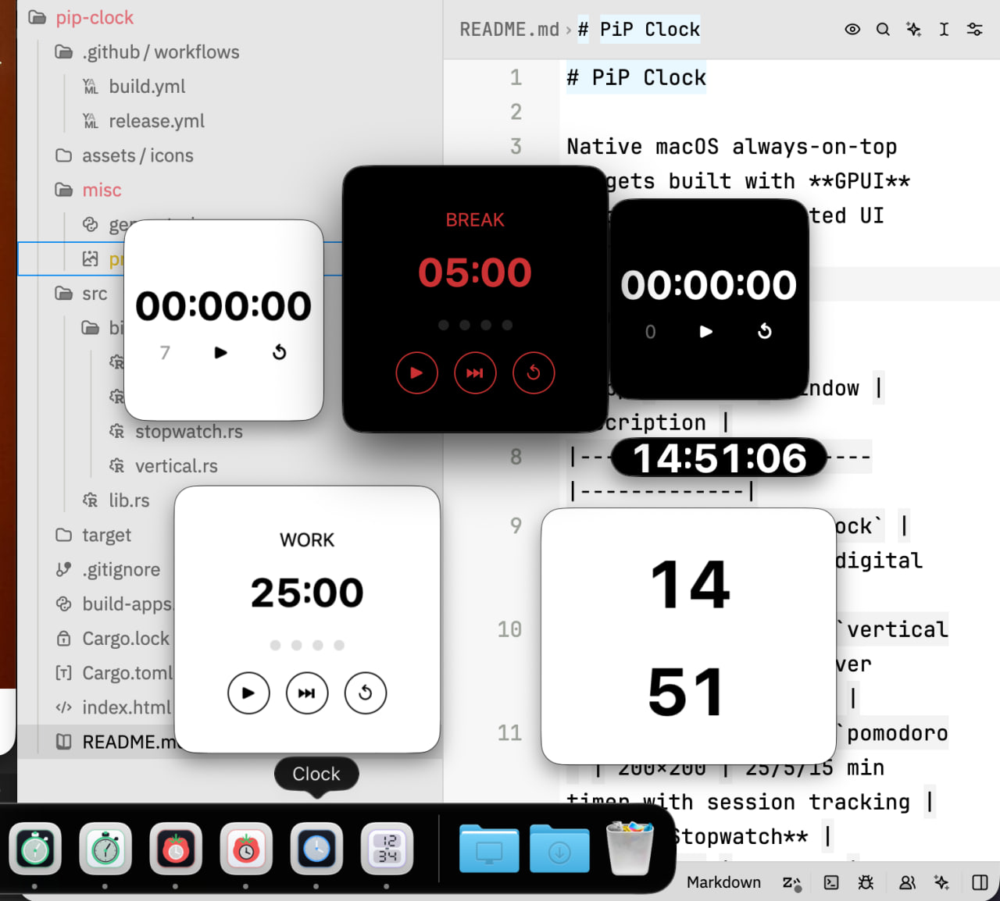

# GPUI Clock Widgets

Native macOS and Windows always-on-top clock widgets built with **GPUI** (Zed's GPU-accelerated UI framework).

## Apps

| App | Binary | Window | Description |
|-----|--------|--------|-------------|
| **PiP Clock** | `clock` | 300×300 | `HH:MM:SS` digital clock |
| **PiP Vertical** | `vertical` | 300×300 | Hours over minutes in large type |
| **PiP Pomodoro** | `pomodoro` | 200×200 | 25/5/15 min timer with session tracking |
| **PiP Stopwatch** | `stopwatch` | 150×150 | Stopwatch with stop/start, reset, and interval history controls |

All widgets use persistent `WindowKind::PopUp` panels. They are draggable, remain visible when focus moves to another app, and stay above normal windows. On macOS they also remain visible across Spaces and hide their traffic-light controls. On Windows they use GPUI's topmost tool-window implementation. Clicking a widget activates its app so keyboard shortcuts work.



## Building

The required [Zed](https://github.com/zed-industries/zed) crates are fetched automatically by Cargo at the commit pinned in `Cargo.toml`. Building requires:

- **macOS:** Xcode.
- **Windows:** Visual Studio Build Tools with the Desktop development with C++ workload and a Windows 10 or 11 SDK. GPUI's release build uses the SDK's `fxc.exe` shader compiler.

The default build is dark. The `light-theme` Cargo feature selects the light theme at compile time:

```bash
cargo build --release                         # dark (default)
cargo build --release --features light-theme  # light
```

## Running

```bash
cargo run --release --bin clock
cargo run --release --bin vertical
cargo run --release --bin pomodoro
cargo run --release --bin stopwatch
```

Keyboard shortcuts available in every app use `Cmd` on macOS and `Ctrl` on Windows:

- `Cmd/Ctrl+N` opens another independent window of the same app.
- `Cmd/Ctrl+W` closes the active window.
- `Cmd/Ctrl+Q` closes all windows and quits the app.

## Creating macOS .app Bundles

Run the build script to compile all binaries in both dark and light variants, assemble their application bundles, and sign them ad hoc:

```bash
./build-apps.py
```

The script enables GPUI runtime shaders, so it does not require the optional command-line Metal toolchain. Intermediate binaries are staged in `target/binaries/{dark,light}`.

To assemble bundles from binaries that are already staged there without rebuilding, use:

```bash
./build-apps.py --skip-build
```

Outputs `.app` bundles to `target/apps/`. Dark apps retain their usual names; light apps have a ` Light` suffix, for example `Clock Light.app`. Each bundle includes a matching dark or light icon from `assets/icons/`. Drag the apps to `/Applications` to install.

## Creating Windows Packages

Run the Windows packaging script from a Windows command prompt or PowerShell session:

```powershell
python build-windows.py
```

It compiles all binaries in dark and light variants and outputs standalone ZIP archives to `target/windows-apps/`, such as `Clock-Windows.zip` and `Clock Light-Windows.zip`. Each archive contains the corresponding `.exe` and the project license. To package binaries already staged in `target/windows-binaries/{dark,light}`, use:

```powershell
python build-windows.py --skip-build
```

Extract an archive and run its `.exe`; no installer is currently provided. CI-produced Windows executables are unsigned, so Windows Defender SmartScreen may show an unrecognized-app warning. Code signing requires a Windows code-signing certificate.

The committed icon assets are ready to package and do not add a build dependency. To regenerate them after editing `misc/generate-icons.py`, install Pillow and run:

```bash
python3 misc/generate-icons.py
```

## Gatekeeper

The bundles are signed ad-hoc during `build-apps.py`, so macOS won't treat them as damaged. However, because they are not signed with a Developer ID or notarized, the first time you open a downloaded app you'll get the "Apple cannot check it for malicious software" dialog. To open it:

- Right-click the app and choose **Open**, then confirm, or
- Remove the quarantine flag from the command line:

```bash
xattr -dr com.apple.quarantine /Applications/PiP\ Clock.app
```

For a fully seamless install (no warning at all), the app needs to be signed with an Apple Developer ID certificate and notarized — that requires a paid Apple Developer account.

## CI / Releases

The `Build` workflow runs on every push to `main`, on version tags matching `v*`, and when started manually. It builds the macOS `.app` archives and Windows `.exe` archives in separate jobs, uploading them as `apps` and `windows-apps` artifacts. It does not create releases.

To publish a release:

1. Tag a commit and push the tag:

   ```bash
   git tag v1.0.0
   git push origin v1.0.0
   ```

2. Once that build for tag succeeds, go to the **Actions** tab, open the `Release` workflow, and run it manually, entering the tag (e.g. `v1.0.0`) as input.

The release is versioned by the tag and attaches each dark app and its light counterpart as a separate ZIP. macOS archives retain names such as `Clock.zip` and `Clock Light.zip`; Windows archives use names such as `Clock-Windows.zip` and `Clock Light-Windows.zip`.

## Architecture

```
src/
├── lib.rs              # Shared Theme enum (Dark / Light)
└── bin/
    ├── clock.rs        # HH:MM:SS clock, ticks every second
    ├── vertical.rs     # Large hours/minutes, ticks every second
    ├── pomodoro.rs     # Phase-based timer with UI controls
    └── stopwatch.rs    # Stopwatch with stop/start, reset, and interval history controls
```

Each binary is a standalone GPUI application using `gpui_platform::application()` as the entry point. Application windows use `WindowKind::PopUp`, which maps to persistent panels on macOS and topmost tool windows on Windows; their root elements activate the app on click for keyboard shortcut handling.

## License

This project is licensed under the [GNU General Public License, version 3 or later](./LICENSE). Third-party dependencies remain subject to their respective licenses.
