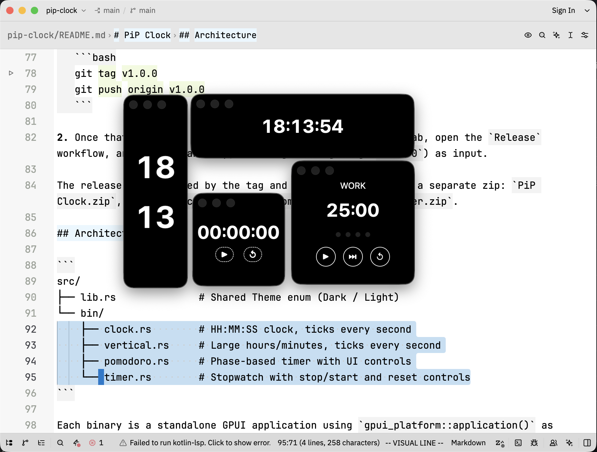

# PiP Clock

Native macOS always-on-top widgets built with **GPUI** (Zed's GPU-accelerated UI framework).

## Apps

| App | Binary | Window | Description |
|-----|--------|--------|-------------|
| **PiP Clock** | `clock` | 300×300 | `HH:MM:SS` digital clock |
| **PiP Vertical** | `vertical` | 300×300 | Hours over minutes in large type |
| **PiP Pomodoro** | `pomodoro` | 200×200 | 25/5/15 min timer with session tracking |
| **PiP Timer** | `timer` | 150×150 | Stopwatch with stop/start and reset controls |

All widgets use activating `WindowKind::Floating` panels. They are draggable, remain above normal windows, hide their traffic-light controls, and reliably receive keyboard shortcuts.



## Building

Requires macOS with Xcode (for Metal shader compilation) and a local clone of [Zed](https://github.com/zed-industries/zed) one directory above:

```
parent/
├── zed/                  # git clone https://github.com/zed-industries/zed
└── pip-clock/            # this repo
```

The default build is dark. The `light-theme` Cargo feature selects the light theme at compile time:

```bash
cargo build --release                         # dark (default)
cargo build --release --features light-theme  # light
```

## Running

```bash
cargo run --release --bin clock
cargo run --release --bin vertical
cargo run --release --bin pomodoro
cargo run --release --bin timer
```

Keyboard shortcuts available in every app:

- `Cmd+N` opens another independent window of the same app.
- `Cmd+W` closes the active window.

## Creating .app Bundles

Run the build script to compile all binaries in both dark and light variants, assemble their application bundles, and sign them ad hoc:

```bash
./build-apps.py
```

The script enables GPUI runtime shaders, so it does not require the optional command-line Metal toolchain. Intermediate binaries are staged in `target/binaries/{dark,light}`.

To assemble bundles from binaries that are already staged there without rebuilding, use:

```bash
./build-apps.py --skip-build
```

Outputs `.app` bundles to `target/apps/`. Dark apps retain their usual names; light apps have a ` Light` suffix, for example `Clock Light.app`. Drag them to `/Applications` to install.

## Gatekeeper

The bundles are signed ad-hoc during `build-apps.py`, so macOS won't treat them as damaged. However, because they are not signed with a Developer ID or notarized, the first time you open a downloaded app you'll get the "Apple cannot check it for malicious software" dialog. To open it:

- Right-click the app and choose **Open**, then confirm, or
- Remove the quarantine flag from the command line:

```bash
xattr -dr com.apple.quarantine /Applications/PiP\ Clock.app
```

For a fully seamless install (no warning at all), the app needs to be signed with an Apple Developer ID certificate and notarized — that requires a paid Apple Developer account.

## CI / Releases

The `Build` workflow runs on every push to `main`. It builds all apps and uploads the `.app` zips as a build artifact. It does not create releases.

To publish a release:

1. Tag a commit and push the tag:

   ```bash
   git tag v1.0.0
   git push origin v1.0.0
   ```

2. Once that build for tag succeeds, go to the **Actions** tab, open the `Release` workflow, and run it manually, entering the tag (e.g. `v1.0.0`) as input.

The release is versioned by the tag and attaches each dark app and its light counterpart as a separate zip: `Clock.zip`, `Clock Light.zip`, `Vertical Clock.zip`, `Vertical Clock Light.zip`, `Pomodoro Timer.zip`, `Pomodoro Timer Light.zip`, `Timer.zip`, and `Timer Light.zip`.

## Architecture

```
src/
├── lib.rs              # Shared Theme enum (Dark / Light)
└── bin/
    ├── clock.rs        # HH:MM:SS clock, ticks every second
    ├── vertical.rs     # Large hours/minutes, ticks every second
    ├── pomodoro.rs     # Phase-based timer with UI controls
    └── timer.rs        # Stopwatch with stop/start and reset controls
```

Each binary is a standalone GPUI application using `gpui_platform::application()` as the entry point. Windows use `WindowKind::Floating` so macOS treats them as activating panels and routes keyboard shortcuts correctly.
